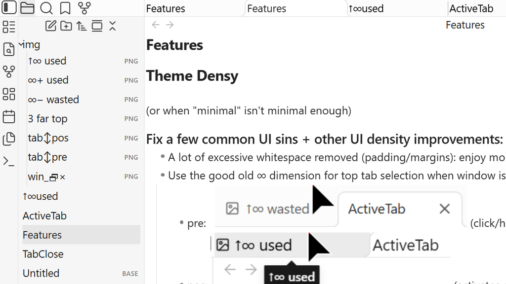
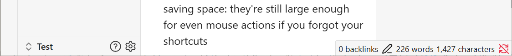

### Theme Densy

(or when "minimal" isn't minimal enough)

#### Fix a few common UI sins + other UI density improvements:
  - A lot of excessive whitespace removed (padding/margins): enjoy more of your content!
  - Use the good old ∞ dimension for top tab selection when window is maximized (🖰 at screen top)
    - pre:    (click/hover fails)
    - pos:  (activates on hover, switches on click)
  - Remove useless window controls (for keyboard/mouse gesture productivity warriors):
    - Min/Max/Close   (it's a sin to group them anyway, __×__ is destructive, so should never be close to nondestructive **\_🗗**)
    - Tab close __×__: click/drag your tabs freely without the fear of a destructive action requiring your to precision-guide your mouse and be aware of your 🮰 surroundings!
  - Minimize labels to just fit the content, especially for items where you mostly use a keyboard to navigate (like tabs)
    - pre:    :pos ~50% saving
  - …while making them more readable: bigger font and darker (the default grays are way too light, don't you want me to actually read the labels???)
  - Similarly, make icons bigger for visibility at the expense of whitespace, but now you can position them closer together, saving space: they're still large enough for even mouse actions if you forgot your shortcuts

#### Densy partial screenshots
  - ↖Main area 
  - ↓Toolbar 

## Install
  - theme: `Options` → `Appearance` → `Themes` → `Manage` → type **Densy** → `Install and use`
    - or copy [manifest.json](./manifest.json) [theme.css](./theme.css) files to your vault's `.obsidian/themes/Densy` folder and then enable the theme in settings 

## Use

## Known issues
  - Theme is WIP and is broken in a few places, also currently unconfigurable
  - Only light version is supported
  - Some items on a smartphone are too small and need to be excluded from `.is_mobile`

## Credits
